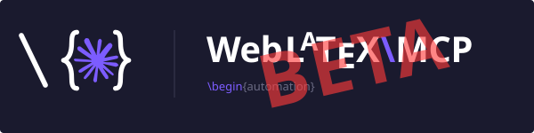

<div align="center">



# WebLatexMCP

**Read, edit, compile, and commit LaTeX in any git-hosted project — straight from Claude.**

[](https://github.com/elias-ramzi/WebLatexMCP/actions/workflows/ci.yml)
&nbsp;

&nbsp;

&nbsp;
[](#license)

**Works with**
&nbsp;
[](docs/install/README.md)

**Pending**
&nbsp;
[](docs/install/gemini.md)
&nbsp;
[](docs/install/copilot.md)
&nbsp;
[](docs/install/mistral.md)

</div>

> [!WARNING]
> **Public beta — very early development.** WebLatexMCP is now public, but it's in its early stages and
> under active development. Expect bugs, rough edges, and incomplete features. Editing and git operations
> touch real projects, so review diffs before you push. Please
> [report anything you run into](https://github.com/elias-ramzi/WebLatexMCP/issues) — bug reports and
> feedback are hugely welcome.

---

An MCP server that lets Claude **read, edit, compile, and commit LaTeX** in a git-hosted project —
**Overleaf**, **GitHub**, or any git remote. It keeps a local clone, compiles locally (TeX Live +
`latexmk`, or `tectonic`) so you see errors and PDFs without round-tripping, and sends changes back through an explicit
commit → push you review first. Works with **Claude Desktop** and **Claude Code** over stdio, on
**macOS, Linux, and Windows**.

Already have the `.tex` on your machine? Point it at that folder — or straight at the file — and it
reads, edits and compiles the real files **in place** — no remote, no clone, no second copy of the
document.

## Highlights

- 🗂️ **Multi-project** — Overleaf, GitHub, or any git remote, side by side, each with its own credentials.
- 📂 **Or no remote at all** — register a folder you already have and work on it in place, so what Claude compiles is the file your editor has open.
- ✏️ **Surgical edits** — atomic, exact-match string replacements; read with optional line ranges.
- 🧪 **Local compiles** — `latexmk` (or `tectonic`) runs on your machine and returns structured errors/warnings + the PDF. A package your TeX installation lacks is named outright, and `doctor` reports what that installation actually has.
- 👀 **Live PDF viewer + review comments** — a local viewer that hot-reloads on every compile (a browser window, or a **VS Code** tab); select text in the PDF to leave notes, and Claude applies them at the right source line via SyncTeX.
- 🔍 **Reviewable pushes** — `commit` and `push` are separate; nothing leaves your machine implicitly.
- 👥 **Parallel sessions** — run a session per section on one clone; each commits only its own edits, so
  nobody sweeps up anyone else's half-written paragraph.
- 🔐 **Tokens stay in memory** — never written to `.git/config`, and scrubbed from all output.
- 📚 **References in any format** — read them structured out of a `.bib`, a LaTeX `thebibliography`, or a prose reference list in a markdown draft, and cross-check what the document cites against what it defines.
- 🧩 **Bundled Claude Code skills** — project cleanup, DBLP citation audits, bibliography normalization.

## Install

Pick your client below. Either way, editing, git, and the PDF viewer work without TeX — only `compile`
needs `latexmk` (default) or `tectonic` on your `PATH`. Not sure what you have? Ask Claude to run
`doctor` and it reports your engines, TeX distribution, and where packages can be installed.

### Claude Code (CLI or the VS Code extension)

Install the **plugin** — it registers the server **and** the [skills](#skills) in every session, from
any directory:

```bash
# In Claude Code:
/plugin marketplace add elias-ramzi/WebLatexMCP
/plugin install web-latex-mcp@web-latex-tools
```

Prefer just the server? Register the npm package in one line (skills still come through as
[prompts](docs/skills.md#two-ways-a-skill-runs)):

```bash
claude mcp add web-latex-mcp --scope user -- npx -y web-latex-mcp
```

💡 Launch Claude Code **from your paper's own repo** so the LaTeX clone lands right beside your code. The
step-by-step [VS Code quickstart](docs/install/vscode-quickstart.md) is the most-tested path.

### Claude Desktop — one-click extension

Download **`web-latex-mcp.mcpb`** from the
[latest release](https://github.com/elias-ramzi/WebLatexMCP/releases/latest) and drag it onto the Claude
Desktop window (or **Settings → Extensions → Install Extension**). No cloning, building, or JSON editing —
Desktop shows a short, all-optional form (tokens, clone folder). See the
[Desktop Extension guide](docs/install/desktop-extension.md).

### Add your token and your project — from the chat

However you installed, the server needs a token for your git host — for Overleaf, a **Git authentication
token** from [Account Settings → Git integration](https://www.overleaf.com/user/settings). The private
way to hand it over, which **never puts the token in the chat**: ask Claude to open the credential portal.

> 👽 Open the credential portal for my Overleaf token.

`credential_portal` opens a local `127.0.0.1` page where you type the token; it goes straight into your
**OS keychain**, never through the conversation. (Happy to paste it once instead? `set_credential` stores
it in the keychain in a single step.)

Then add your project by just giving Claude the git URL — it registers it with `register_project`, and it
persists across restarts and sessions:

> 👽 Add my Overleaf project https://git.overleaf.com/… and call it "thesis".

Working on a `.tex` that is already on this machine? Give it a folder instead — no token, no remote, and
nothing is cloned ([details](docs/tools.md#local-in-place-projects)):

> 👽 Add the folder ~/papers/neurips as a local project called "paper".

### Other clients & full configuration

Prefer env vars (`WEB_LATEX_MCP_PROJECTS`, per-host tokens, workspace, compiler), or using **Gemini** /
**GitHub Copilot**? It's all in the docs: [Configuration](docs/configuration.md) · per-OS guides for
[macOS](docs/install/macos.md) / [Linux](docs/install/linux.md) / [Windows](docs/install/windows.md) ·
[Gemini](docs/install/gemini.md) · [Copilot](docs/install/copilot.md).

## What you can do

Once connected, ask Claude to work on your project — it drives these [tools](docs/tools.md):

- **Add a project from the chat** — paste a git URL and Claude registers it (`register_project`), persisted across restarts and sessions — no env config needed ([details](docs/configuration.md#registering-a-project-without-env-config)).
- **Compile what you already have** — register by `path` instead of a git URL — a directory, or just the document itself (`~/proposals/eurohpc.md`), and the folder holding it is used — and the server reads, edits and compiles it **in place**: no clone, no second copy of the document to drift apart ([details](docs/tools.md#local-in-place-projects)).
- **Sync & browse** — clone/pull a git project, list and read files.
- **Edit** — create, overwrite, or make surgical string-replacement edits to `.tex` files.
- **Compile** — run `latexmk` (or `tectonic`) locally and get back structured errors, warnings, and a clickable `file://` link to the PDF. For TikZ externalization, opt in per compile with `restrictedShellEscape` (preferred) or `shellEscape` — both **default off** and never auto-enabled, since `-shell-escape` lets a `.tex` run arbitrary commands ([details](docs/tools.md#shell-escape-for-tikz-externalization)).
- **Diagnose the toolchain** — `doctor` reports what the machine actually has (engines, TeX distribution and its age, the package manager and the repository it would install from, writable install paths), so a missing package or an end-of-life TeX Live is a one-call answer instead of a chain of failed compiles ([details](docs/tools.md#missing-packages)).
- **Cite** — search [DBLP](https://dblp.org) and add verified BibTeX entries (`.bib` files are protected
  from hand-edits — see [Citations](docs/tools.md#citations-via-dblp)).
- **Read the references you already have** — `list_references` returns them structured (key, title, authors, year, venue, DOI/arXiv, file and line) from a `.bib`, a LaTeX `thebibliography`, **or a reference list written as prose in a markdown document** — and `check_citations` diffs what the draft cites against what the bibliography defines ([details](docs/tools.md#references-in-any-format)).
  _Nice to have, not there yet:_ `check_citations` works within **one** project, since its paths stay
  sandboxed there. A draft that cites a `.bib` belonging to another registered project — a shared group
  bibliography — is cross-checked today with two `list_references` calls and a comparison (the
  [`/verify-citations` skill](docs/skills.md#verify-citations--audit-citations-against-dblp) spells out
  how); a single cross-project tool would be nicer. [Ideas and PRs welcome.](CONTRIBUTING.md)
- **Review & push** — inspect `status` / `diff`, commit, then push safely (rebase, never force; conflicts
  come back to you with both sides, and you resolve them by pushing the merged content back — or rewind
  the clone to the current remote with `reset_to_remote` and redo your edits cleanly).

See the [full tool reference](docs/tools.md).

## Skills

Task-specific skills that drive the tools — each stops at the diff, so nothing is committed or pushed
unless you ask:

- **`/format-latex-project`** — split the main file into per-section `\input`s, move each figure/table into its own `\input` file, and reflow to one sentence per line.
- **`/arxiv-clean-project`** — run [arxiv-latex-cleaner](https://github.com/google-research/arxiv-latex-cleaner) to strip comments and draft macros (`\todo`, notes) for arXiv, as a separate submission copy or applied in place.
- **`/verify-citations`** — audit a document's references against DBLP, flag discrepancies, and write a local audit report (read-only for the bibliography). Works on a `.bib`, a LaTeX `thebibliography`, or a markdown reference list — and on a local folder with no git remote.
- **`/format-bibliography`** — deduplicate, normalize cite keys, harmonize venues, propagate renames into `\cite`s.
- **`/summarize-paper`** — write/update a small local summary of the paper (git-excluded) so future sessions start fast.
- **`/session-feedback`** — run it at the _end_ of a session to review what happened and write up what would improve the server itself: what broke, what took too many calls, what was missing, what the docs got wrong. Ranked by impact, scrubbed of your paper and your tokens, ready to paste into an issue ([contributing](CONTRIBUTING.md#feedback-from-a-session)).

**How you get them depends on the client:**

- **Claude Code** — [install the plugin](#claude-code-cli-or-the-vs-code-extension)
  (or launch Claude Code from a clone of this repo). Claude picks a skill up on its own when your request
  matches it.
- **Any MCP client** — nothing to install. Every skill is also registered as an **MCP prompt**, so it
  ships with the server; pick it from the client's prompt menu (in Claude Desktop, the `+` in the
  composer) instead of typing `/`. Claude can also find and follow one on its own through the
  `list_skills` tool, without the skills being installed anywhere.
- **Claude Desktop / claude.ai**, for the same automatic behavior Claude Code gets — upload the skills to
  your account: zip each folder under [`.claude/skills/`](.claude/skills/), then upload them under
  **Customize → Skills → + → Create skill**. Needs a paid plan with code execution enabled, and an
  uploaded copy is a snapshot, so re-upload when a skill changes.

See the [skills guide](docs/skills.md) for what each skill does, [step-by-step installation](docs/skills.md#installing),
and [the two ways a skill runs](docs/skills.md#two-ways-a-skill-runs).

## Documentation

- [Configuration](docs/configuration.md) — environment variables, per-host token resolution, in-context guides, cross-platform notes.
- [Tools](docs/tools.md) — full tool reference, the DBLP citation flow, and how safe pushes work.
- [Skills](docs/skills.md) — what each bundled skill does, how to install it per client, and the two ways one runs.
- [Concurrency](docs/CONCURRENCY.md) — how the server pushes without clobbering edits made elsewhere, and how parallel sessions share one clone.
- [Writing guide](docs/writing-guide.md) — the LaTeX style conventions surfaced to the client.
- [Contributing](CONTRIBUTING.md) — how to build, test, and open a pull request.

## Contributing

This repo **accepts pull requests** — bug reports, feature ideas, docs fixes, and code changes are all
welcome. See [CONTRIBUTING.md](CONTRIBUTING.md) for how to get set up, run the local gate, and open a PR.

**Telling us how a session went is a contribution too**, and the fastest one to make. At the end of a
session spent working through the server, run the [`/session-feedback`](.claude/skills/session-feedback/SKILL.md)
skill: it looks back over the tool calls that actually ran — the ones that failed, the detours, the
guard that fired for the wrong reason, the thing you wanted and could not do — and writes a short,
ranked report stamped with your server version and toolchain. It reports on the _server_, never on your
paper: it edits nothing, commits nothing, pushes nothing, and it strips tokens, paths, and manuscript
content before printing, because the report is written to be handed to a stranger. You get a report to
paste into an issue (or, if you say so, `gh` files it for you). See
[Feedback from a session](CONTRIBUTING.md#feedback-from-a-session).

A note on maturity: this project is largely vibe-coded, so treat it as best-effort rather than
battle-tested. Robustness isn't guaranteed — expect rough edges, and please report them. It has been
mostly tested on these setups: VS Code + Claude Code extension, the Claude Code CLI, and Claude Desktop
for macOS.

## License

MIT
