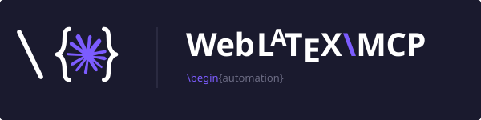

<div align="center">



# WebLatexMCP

**Read, edit, compile, and commit LaTeX in any git-hosted project — straight from Claude.**

[](https://github.com/elias-ramzi/WebLatexMCP/actions/workflows/ci.yml)
&nbsp;

&nbsp;

&nbsp;
[](#license)

**Works with**
&nbsp;
[](docs/install/README.md)
&nbsp;
[](docs/install/gemini.md)
&nbsp;
[](docs/install/copilot.md)

</div>

---

An MCP server that lets Claude **read, edit, compile, and commit LaTeX** in a git-hosted project —
**Overleaf**, **GitHub**, or any git remote. It keeps a local clone, compiles locally (TeX Live +
`latexmk`, or `tectonic`) so you see errors and PDFs without round-tripping, and sends changes back through an explicit
commit → push you review first. Works with **Claude Desktop** and **Claude Code** over stdio, on
**macOS, Linux, and Windows**.

## Highlights

- 🗂️ **Multi-project** — Overleaf, GitHub, or any git remote, side by side, each with its own credentials.
- ✏️ **Surgical edits** — atomic, exact-match string replacements; read with optional line ranges.
- 🧪 **Local compiles** — `latexmk` (or `tectonic`) runs on your machine and returns structured errors/warnings + the PDF.
- 🔍 **Reviewable pushes** — `commit` and `push` are separate; nothing leaves your machine implicitly.
- 🔐 **Tokens stay in memory** — never written to `.git/config`, and scrubbed from all output.
- 🧩 **Bundled Claude Code skills** — project cleanup, DBLP citation audits, bibliography normalization.

## Quick start

The easiest way in: **clone this repo, point Claude Code at the folder, and just ask.**

```bash
git clone https://github.com/elias-ramzi/WebLatexMCP.git
```

Then let Claude walk you through the rest:

> 👽 **You**
>
> Claude, can you walk me through how to install the WebLatexMCP server?

> ✦ **Claude**
>
> Absolutely — I'll install dependencies, build the server, register it with Claude, and help you
> add your first Overleaf project. Let's go step by step.

Claude drives the whole setup from the chat. Editing and git operations work without TeX; only
`compile` needs a backend on your `PATH` — `latexmk` by default, or `tectonic` (set `WEB_LATEX_MCP_COMPILER`;
see [Configuration](docs/configuration.md#compile-backend)).

### ⚡ Super fast start in VS Code — recommended

The **[step-by-step VS Code guide](docs/install/vscode-quickstart.md)** is the most tested and by far
the most efficient path. Best of all, run it **from your paper's own repo** — that way Claude sees
your code _and_ writes the paper right alongside it.

### Detailed setup, all platforms

Prerequisites, authentication, and registering with both Claude Code & Claude Desktop:
[macOS](docs/install/macos.md) · [Linux](docs/install/linux.md) · [Windows](docs/install/windows.md).

Using **Gemini** or **GitHub Copilot** instead? See the [Gemini guide](docs/install/gemini.md) (Gemini
CLI and Gemini Code Assist) or the [Copilot guide](docs/install/copilot.md) (Copilot agent mode in VS
Code / Visual Studio) — both register the same server over stdio.

### Or install from npm — no clone, no build

Prefer not to clone the repo? Register the published package with `npx`. Editing and git work without
TeX; only `compile` needs `latexmk` or `tectonic` on your `PATH`. Add this to your Claude Code or Claude
Desktop MCP config:

```json
{
  "mcpServers": {
    "web-latex-mcp": {
      "command": "npx",
      "args": ["-y", "web-latex-mcp"],
      "env": {
        "WEB_LATEX_MCP_PROJECTS": "{\"thesis\":{\"gitUrl\":\"https://git.overleaf.com/…\"}}"
      }
    }
  }
}
```

Or add it in one line with Claude Code:

```bash
claude mcp add web-latex-mcp --scope user -- npx -y web-latex-mcp
```

### Or install the Claude Code plugin — server **and** skills together

The `claude mcp add` / raw-config routes register the server but **not** the [skills](#skills-claude-code) —
those only load when Claude Code is launched from a clone of this repo. Installing the **plugin** instead
gives you the MCP server _and_ all the skills in every session, from any directory:

```bash
# In Claude Code:
/plugin marketplace add elias-ramzi/WebLatexMCP
/plugin install web-latex-mcp@web-latex-tools
```

The plugin pins no workspace, so clones still land beside your paper (the workspace-local default). Set
`WEB_LATEX_MCP_PROJECTS` in your own MCP config, or register projects at runtime, as usual.

## What you can do

Once connected, ask Claude to work on your project — it drives these [tools](docs/tools.md):

- **Sync & browse** — clone/pull a project, list and read files.
- **Edit** — create, overwrite, or make surgical string-replacement edits to `.tex` files.
- **Compile** — run `latexmk` (or `tectonic`) locally and get back structured errors, warnings, and a clickable `file://` link to the PDF.
- **Cite** — search [DBLP](https://dblp.org) and add verified BibTeX entries (`.bib` files are protected
  from hand-edits — see [Citations](docs/tools.md#citations-via-dblp)).
- **Review & push** — inspect `status` / `diff`, commit, then push safely (rebase, never force; conflicts
  come back to you with both sides, and you resolve them by pushing the merged content back).

See the [full tool reference](docs/tools.md).

## Skills (Claude Code)

Claude Code loads task-specific skills that drive the tools — each stops at the diff, so nothing is
committed or pushed unless you ask. You get them by [installing the plugin](#or-install-the-claude-code-plugin--server-and-skills-together)
(available everywhere) or by launching Claude Code from a clone of this repo:

- **`/format-latex-project`** — split the main file into per-section `\input`s and reflow to one sentence per line.
- **`/arxiv-clean-project`** — run [arxiv-latex-cleaner](https://github.com/google-research/arxiv-latex-cleaner) to strip comments and draft macros (`\todo`, notes) for arXiv, as a separate submission copy or applied in place.
- **`/verify-citations`** — audit every `.bib` entry against DBLP, flag discrepancies, and write a local git-excluded audit report (read-only for the `.bib`).
- **`/format-bibliography`** — deduplicate, normalize cite keys, harmonize venues, propagate renames into `\cite`s.
- **`/summarize-paper`** — write/update a small local summary of the paper (git-excluded) so future sessions start fast.

See the [skills guide](docs/skills.md) for details.

## Documentation

- [Configuration](docs/configuration.md) — environment variables, per-host token resolution, in-context guides, cross-platform notes.
- [Tools](docs/tools.md) — full tool reference, the DBLP citation flow, and how safe pushes work.
- [Skills](docs/skills.md) — what each bundled Claude Code skill does.
- [Concurrency](docs/CONCURRENCY.md) — how the server pushes without clobbering edits made elsewhere.
- [Writing guide](docs/writing-guide.md) — the LaTeX style conventions surfaced to the client.
- [Contributing](CONTRIBUTING.md) — how to build, test, and open a pull request.

## Contributing

This repo **accepts pull requests** — bug reports, feature ideas, docs fixes, and code changes are all
welcome. See [CONTRIBUTING.md](CONTRIBUTING.md) for how to get set up, run the local gate, and open a PR.

A note on maturity: this project is largely vibe-coded, so treat it as best-effort rather than
battle-tested. Robustness isn't guaranteed — expect rough edges, and please report them. It has been
mostly tested on these setups: VS Code + Claude Code extension, the Claude Code CLI, and Claude Desktop
for macOS.

## License

MIT
