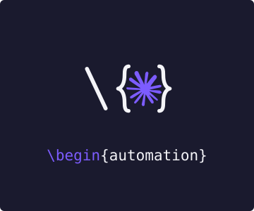

<div align="center">



# latex-git-mcp

**Read, edit, compile, and commit LaTeX in any git-hosted project — straight from Claude.**

[](https://github.com/elias-ramzi/overleaf_mcp/actions/workflows/ci.yml)
&nbsp;

&nbsp;

&nbsp;
[](#license)

</div>

---

An MCP server that lets Claude **read, edit, compile, and commit LaTeX** in a git-hosted project —
**Overleaf**, **GitHub**, or any git remote. It keeps a local clone, runs LaTeX compilation locally
(TeX Live + `latexmk`) so you see errors and PDFs without round-tripping, and sends changes back via an
explicit, reviewable commit → push to the repo's default branch. Works with both **Claude Desktop** and
**Claude Code** over stdio, on **macOS, Linux, and Windows**.

## Highlights

- 🗂️ **Multi-project** — Overleaf, GitHub, or any git remote, side by side, each with its own credentials.
- ✏️ **Surgical edits** — atomic, exact-match string replacements; read with optional line ranges.
- 🧪 **Local compiles** — `latexmk` runs on your machine and returns structured errors/warnings + the PDF.
- 🔍 **Reviewable pushes** — `commit` and `push` are separate steps; nothing leaves your machine implicitly.
- 🔐 **Tokens stay in memory** — never written to `.git/config`, and scrubbed from all output.

## Requirements

- **Node.js ≥ 20** and **git** on your `PATH`.
- A git remote you can authenticate to over HTTPS with a token:
  - **Overleaf** (Premium): a Git authentication token, or
  - **GitHub**: a Personal Access Token (PAT) with repo access, or any other host.
- For local compilation: **TeX Live / MiKTeX** with **`latexmk`** on your `PATH`. Editing and git
  operations work without TeX; only the `compile` tool needs it.
  - **macOS**: `brew install --cask mactex` (or BasicTeX + `sudo tlmgr install latexmk`)
  - **Linux**: `sudo apt install texlive texlive-latex-extra latexmk` (or the `dnf` equivalent)
  - **Windows**: install [MiKTeX](https://miktex.org) or TeX Live and ensure `latexmk` is on `PATH`

## Install

```bash
npm install
npm run build      # emits dist/
```

This produces `dist/index.js`, the stdio entry point.

## Configuration

Configured entirely through environment variables (set them in your MCP client's `env` block).

| Variable                                       | Required | Description                                                                                                                   |
| ---------------------------------------------- | -------- | ----------------------------------------------------------------------------------------------------------------------------- |
| `GIT_MCP_PROJECTS`                             | yes      | JSON map of project id → `{ gitUrl, rootFile?, branch?, username?, tokenEnv? }`.                                              |
| `GIT_MCP_WORKSPACE`                            | no       | Directory holding one clone per project. Default `~/.latex-git-mcp/projects`.                                                 |
| `GIT_MCP_DEFAULT_PROJECT`                      | no       | Project id used when a tool call omits `project`.                                                                             |
| `GIT_MCP_AUTHOR_NAME` / `GIT_MCP_AUTHOR_EMAIL` | no       | Identity used for commits. Default `LaTeX Git MCP <latex-git-mcp@localhost>`.                                                 |
| `GIT_MCP_WRITING_GUIDE`                        | no       | Path to a LaTeX writing guide surfaced to the client. Default bundled [`docs/writing-guide.md`](docs/writing-guide.md).       |
| `GIT_MCP_CONCURRENCY_GUIDE`                    | no       | Path to a concurrency / safe-push guide surfaced to the client. Default bundled [`docs/CONCURRENCY.md`](docs/CONCURRENCY.md). |

`GIT_MCP_PROJECTS` example — one Overleaf project and one GitHub repo:

```json
{
  "thesis": { "gitUrl": "https://git.overleaf.com/0123456789abcdef", "rootFile": "main.tex" },
  "paper": { "gitUrl": "https://github.com/me/paper", "branch": "main" }
}
```

(Find an Overleaf git URL under **Menu → Git** and a token under **Account Settings → Git authentication
token**. For GitHub, create a PAT under **Settings → Developer settings → Personal access tokens**.)

### Tokens — resolved per host

Tokens are used as the HTTPS password. For a project the server tries, in order: a per-project
`tokenEnv`, the host's token env (below), the generic `GIT_MCP_TOKEN`, the **GitHub CLI**
(`gh auth token`), then your **git credential helper** (`git credential fill` — works on every OS):

| host               | token env            | default username |
| ------------------ | -------------------- | ---------------- |
| `github.com`       | `GITHUB_TOKEN`       | `x-access-token` |
| `gitlab.com`       | `GITLAB_TOKEN`       | `oauth2`         |
| `git.overleaf.com` | `OVERLEAF_GIT_TOKEN` | `git`            |
| _any other_        | `GIT_MCP_TOKEN`      | `git`            |

A project can override with its own `tokenEnv` (names an env var holding the token) and/or `username`.
So Overleaf and GitHub projects coexist with different credentials.

**No token in the config?** The server uses, if available:

- **The GitHub CLI** — `gh auth login` (any OS); leave `GITHUB_TOKEN` unset and the server runs
  `gh auth token`. `gh auth setup-git` also works (gh becomes git's credential helper).
- **Your OS git credential helper**, queried via `git credential fill`: **osxkeychain** (macOS),
  **libsecret**/cache (Linux, e.g. `sudo apt install libsecret-1-0 libsecret-tools` +
  `git config --global credential.helper libsecret`), **Git Credential Manager** (Windows, bundled with
  Git for Windows). Populate it once with `gh auth setup-git`, your normal `git push`, or
  `printf 'protocol=https\nhost=github.com\nusername=x\npassword=<TOKEN>\n\n' | git credential approve`.

Tokens are injected into git operations **in memory only** — after cloning, the remote is reset to a
**tokenless** URL, so nothing lands in `.git/config`. Every known host token is scrubbed from error
messages and tool output. Git runs with `GIT_TERMINAL_PROMPT=0`, so a missing/expired credential fails
fast instead of hanging.

## Registering the server

**Prefer a step-by-step guide?** See [`docs/install/`](docs/install/) —
[macOS](docs/install/macos.md) · [Linux](docs/install/linux.md) · [Windows](docs/install/windows.md).

### Claude Code (macOS / Linux / Windows)

```bash
claude mcp add latex-git --scope user -- node /absolute/path/to/overleaf_mcp/dist/index.js
```

Set env via `-e KEY=value`, or a project-scoped `.mcp.json` (supports `${VAR}` expansion — commit it
without secrets):

```jsonc
{
  "mcpServers": {
    "latex-git": {
      "command": "node",
      "args": ["./dist/index.js"],
      "env": {
        "GITHUB_TOKEN": "${GITHUB_TOKEN}",
        "GIT_MCP_PROJECTS": "{\"paper\":{\"gitUrl\":\"https://github.com/me/paper\",\"branch\":\"main\"}}",
        "GIT_MCP_DEFAULT_PROJECT": "paper",
      },
    },
  },
}
```

Inspect with `/mcp`. On **Windows**, this works in PowerShell, cmd, and WSL; under WSL use Linux-style
paths.

### Claude Desktop (macOS / Windows)

Edit `claude_desktop_config.json` and **restart the app**:

- **macOS**: `~/Library/Application Support/Claude/claude_desktop_config.json`
- **Windows**: `%APPDATA%\Claude\claude_desktop_config.json`

(Claude Desktop has no Linux build — use Claude Code there.) Desktop does **not** expand env vars, so
inline non-secret config and rely on `gh` / your git credential helper for the token. **Use
forward-slash paths even on Windows** to avoid JSON backslash escaping:

```jsonc
{
  "mcpServers": {
    "latex-git": {
      "command": "node",
      "args": ["C:/Users/you/overleaf_mcp/dist/index.js"],
      "env": {
        "GIT_MCP_PROJECTS": "{\"paper\":{\"gitUrl\":\"https://github.com/me/paper\",\"branch\":\"main\"}}",
        "GIT_MCP_DEFAULT_PROJECT": "paper",
      },
    },
  },
}
```

**PATH note:** the server is a subprocess, so `node`, `git`, `gh`, and `latexmk` must be on _its_ `PATH`.
Claude Code inherits your shell `PATH`. **macOS** Claude Desktop is launched by the GUI with a minimal
`PATH` — use absolute paths or add a `"PATH"` entry to the `env` block. **Windows** Claude Desktop
usually inherits the user `PATH`.

## Tools

All tools take an optional `project` id (defaults to `GIT_MCP_DEFAULT_PROJECT`). File paths are always
POSIX (`/`-separated), on every OS.

| Tool            | Description                                                                                                                                                    |
| --------------- | -------------------------------------------------------------------------------------------------------------------------------------------------------------- |
| `list_projects` | List configured projects and their clone status.                                                                                                               |
| `project_sync`  | Clone if missing, else fast-forward pull. Surfaces divergence instead of merging. Pass `gitUrl` to register a new project.                                     |
| `list_files`    | List files, filter `tex` / `bib` / `assets` / `all`.                                                                                                           |
| `read_file`     | Read a text file (optional line range). Binaries return a path, not bytes.                                                                                     |
| `write_file`    | Create or overwrite a file.                                                                                                                                    |
| `edit_file`     | Surgical string-replacement edits (unique match unless `replaceAll`; atomic).                                                                                  |
| `delete_file`   | Delete a file from the project.                                                                                                                                |
| `compile`       | Compile locally with latexmk; returns success, PDF path, structured errors/warnings + raw log tail.                                                            |
| `status`        | Branch, ahead/behind, staged/unstaged/untracked.                                                                                                               |
| `diff`          | Unified diff + per-file line counts.                                                                                                                           |
| `discard`       | Discard uncommitted changes (requires `confirm: true`).                                                                                                        |
| `commit`        | Stage and commit locally. Does **not** push.                                                                                                                   |
| `push`          | Safe push: pull-rebase onto the latest remote, then push (never force). Surfaces conflicts for a human; `mode: "branch"` for review. Requires `confirm: true`. |

### Writing guide in context

At startup the server reads a LaTeX writing guide and surfaces it to the client two ways: as the MCP
`instructions` hint (so a client like Claude keeps it in context for the whole session — no need to ask
it to read the file) and as a fetchable **resource** at `guide://latex/writing-guide` (so you can
re-open it on demand and clients that ignore `instructions` can still reach it). The bundled
[`docs/writing-guide.md`](docs/writing-guide.md) covers tense, style, figures, equations, bibliography,
and English-usage conventions. Point `GIT_MCP_WRITING_GUIDE` at your own file to override it, or set it
to a non-existent path to ship no guide (the server logs to stderr and starts normally either way; with
no guide, neither the instructions nor the resource is advertised).

### Concurrency guide in context

The same way, the server surfaces a concurrency / safe-push guide as both the `instructions` hint and a
fetchable **resource** at `guide://latex/concurrency`. The bundled [`docs/CONCURRENCY.md`](docs/CONCURRENCY.md)
explains how this server pushes without clobbering edits made elsewhere (people editing in the Overleaf
web editor, or other agents). Override it with `GIT_MCP_CONCURRENCY_GUIDE`.

### Reviewable, safe pushes

`commit` and `push` are separate, and nothing pushes automatically. Review with `status` / `diff`,
`commit` locally, then `push` with `confirm: true`. Because people may also be editing in the Overleaf
web editor, `push` is **safe by default**: it `pull --rebase`s onto the latest remote (immediately before
pushing) and **never force-pushes**. A rebase conflict means the agent and a human touched the same lines —
`push` aborts the rebase and returns `status: "conflict"` with both versions, for a human to resolve; it
never auto-merges. For larger edits, `mode: "branch"` commits to a local review branch and returns its
diff, landing it only on `approve: true`. See [`docs/CONCURRENCY.md`](docs/CONCURRENCY.md) for the full model.

### Cross-platform notes

- File paths in tool output are POSIX (`/`), regardless of OS.
- Clones force `core.autocrlf=false`, so files keep their repo (LF) line endings and `edit_file`'s exact
  match is deterministic on Windows.
- Secrets come from env vars, the GitHub CLI, or your git credential helper — no OS-specific config.

## Development

```bash
npm run typecheck     # tsc --noEmit
npm run lint          # eslint
npm run format        # prettier --write
npm test              # vitest: unit + integration (bare-repo stand-in, no secrets)
npm run test:smoke    # full compile/loop smoke (needs latexmk; auto-skips otherwise)
```

CI (GitHub Actions) runs lint + typecheck + build + tests on **ubuntu, windows, and macos**, plus a
separate Linux job that installs a minimal TeX Live + `latexmk` (via `apt`) for the compile smoke.
Integration tests use a local bare repo as an Overleaf/GitHub stand-in, so **no secrets are ever needed**.

## License

MIT
